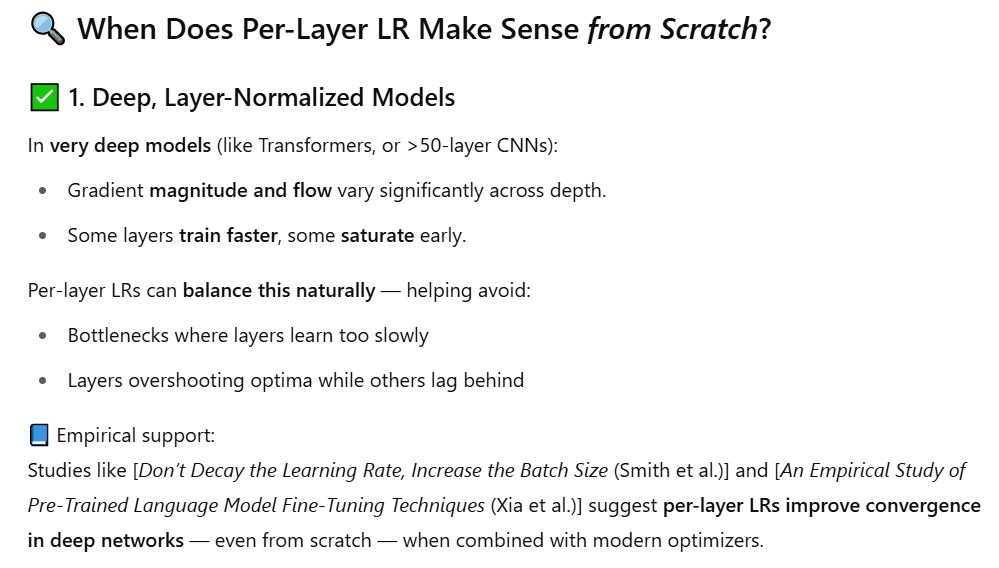

## Understading LLM, GPT and Neural Nets From Scratch
This repository contains Jupyter notebooks created while coding along with Andrej Karpathy's `Neural Networks: Zero to Hero` lecture series.  

Following are covered in the lectures:  
* Backpropagation coded from scratch, `No Autograd`. Intution developed from calculus chain rule and coded in real time
* `Batch normalization` coded and dsicussed in detail
* Neural Net (NN) `training dynamics` discussed in detail
* Importance of weight matrix initialization in NN training
* Activation functions, their graphs and derivates and how they effect NN training
* `Debugging neural net` training issues using various layer level graph plots. (aka Diagnostic tools)
* Explained and developed `Decoder Only Transformer Block` and used it to develop GPT. Also explained Encoder-Decoder attention blocks
* Briefly touched upon post training processes related to LLM (GPT here)

## My Appraoch
As opposed to just watching the lectures and taking handwritten notes, I actively coded along with them. This made me think deeply on what was being taught.  

My notebooks here are slightly different from the lectures in following ways:
* I have intentionally `retained experimental cells`, which he used for explaining concepts and later deleted to avoid clutter, so that it easier to understand later on.
* I have noted `important comments` made by him while explaining some concepts

## Brainstorming with ChatGPT
While watching the lectures, I had many doubts and concerns about various comments and concepts introduced by Andrej. To make better sense of them, I engaged in `deep discussion sessions with ChatGPT`, which turned out to be highly insightful and significantly improved my understanding of the lecture content  

I have shared the snapshots of those chats below as future reference for myself or anyone who may find them useful (visible on expanding through).

Why would I have low learning rate for layers close to input when gradient is already low there ?

**Question Motivation**:
- Without alternate explanation, basic intution should tell you learning rate should compensate for low gradient in initial layers due to cascaded multilication, intentionally wanting it to be low for early layers needs better explanation

Should we vary learning rate depending on state of the network, layer position and whether we are training from scratch or not ?

