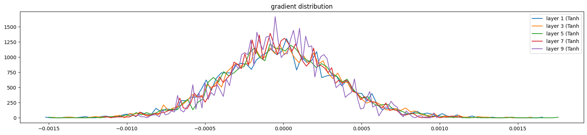
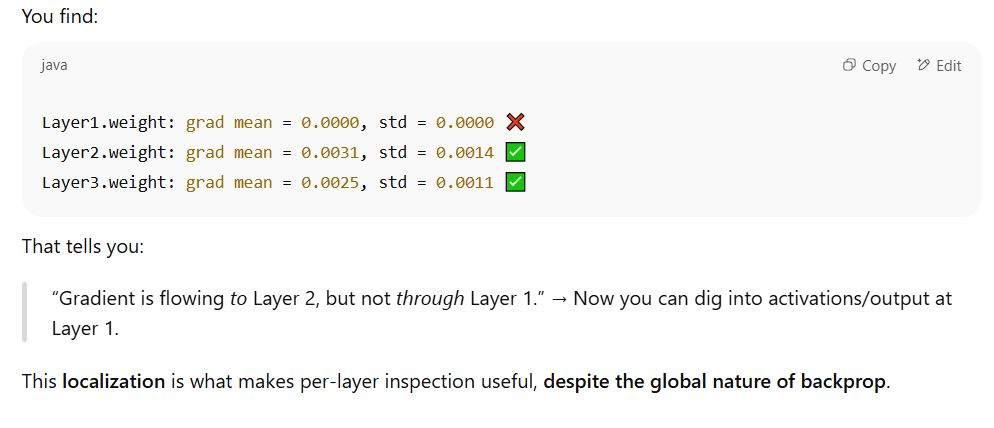
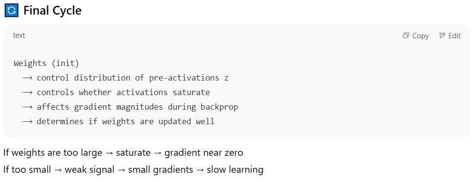
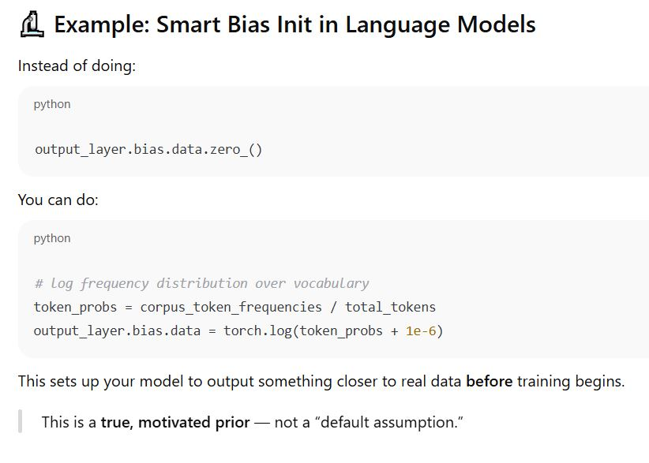
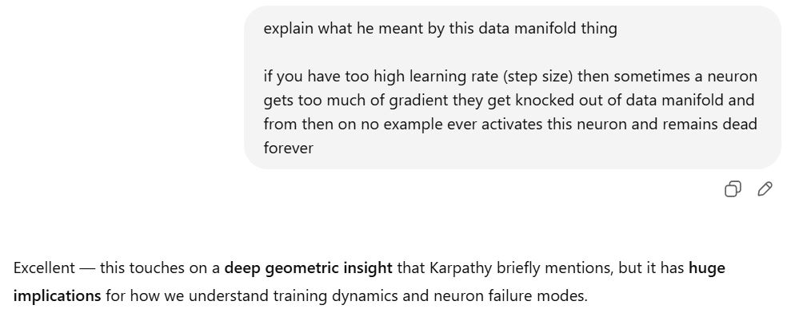
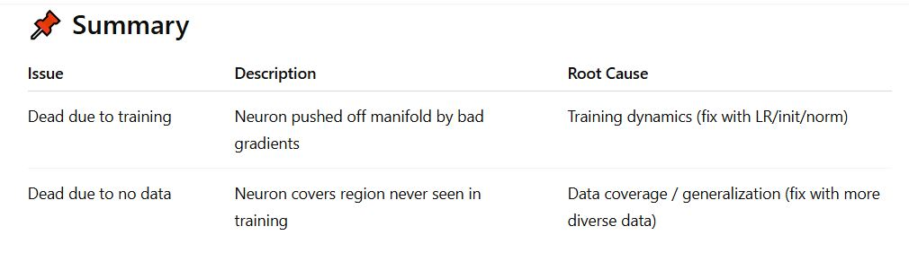
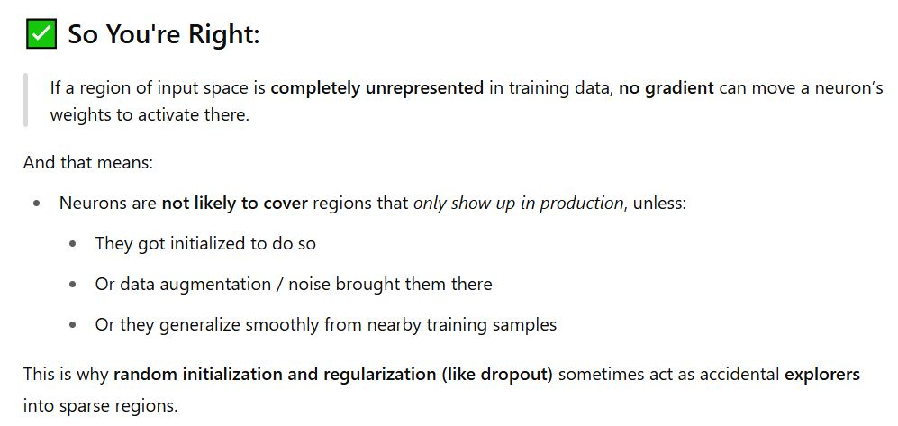

## Understading LLM, GPT and Neural Nets From Scratch
This repository contains Jupyter notebooks created while coding along with Andrej Karpathy's `Neural Networks: Zero to Hero` lecture series.  

In a `podcast with Lex Fridman`, He shared how he surprised himself when results for some experiment weren't as he expected and he too learnt something from it while `Going back to basics` in these lectures.

Following are covered in the lectures:  
* Backpropagation coded from scratch, `No Autograd`. Intution developed from calculus chain rule and coded in real time
* `Batch normalization` coded and dsicussed in detail
* Neural Net (NN) `training dynamics` discussed in detail
* Importance of weight matrix initialization in NN training
* Activation functions, their graphs and derivates and how they effect NN training
* `Debugging neural net` training issues using various layer level graph plots. (aka Diagnostic tools)
* Explained and developed `Decoder Only Transformer Block` and used it to develop GPT. Also explained Encoder-Decoder attention blocks
* Briefly touched upon post training processes related to LLM (GPT here)

## My Appraoch
As opposed to just watching the lectures and taking handwritten notes, I actively coded along with them. This made me think deeply on what was being taught.  

My notebooks here are slightly different from the lectures in following ways:
* I have intentionally `retained experimental cells`, which he used for explaining concepts and later deleted to avoid clutter, so that it easier to understand later on.
* I have noted `important comments` made by him while explaining some concepts

## Brainstorming with ChatGPT
While watching the lectures, I had many doubts and concerns about various comments and concepts introduced by Andrej. To make better sense of them, I engaged in `deep discussion sessions with ChatGPT`, which turned out to be highly insightful and significantly improved my understanding of the lecture content  

I have shared the snapshots of those chats below as future reference for myself or anyone who may find them useful (visible on expanding through).

Why would I have low learning rate for layers close to input when gradient is already low there ?

**Question Motivation**:
- Without alternate explanation, basic intution should tell you learning rate should compensate for low gradient in initial layers due to cascaded multilication, intentionally wanting it to be low for early layers needs better explanation

Should we vary learning rate depending on state of the network, layer position and whether we are training from scratch or not ?

c

---

Andrej spent considerable time on training dynamics of neural networks and daignostic tools for detecting, debugging issues with neural network training using various graph plots of several quantities.

Neural network training dynamics, diagnostic tools and techniques

 Weight, activations and gradient Distribution

 We are making distributions to be zero mean normals, so these are small numbers and they will multiply and produce smaller numbers, so how does this make sense, there seems to be opposing forces here

 Is training neural net same as learning from data ?

 Should we initialize weights so that all outputs at the start are equally likely to start with ?

 What is symmetry breaking and how does it reate to neural nets ?

 Dead neurons, learning rate, data manifold how do they relate ?

 Are dead neurons really a training bug or they tell something meaningful ?

 Are there research work concerning interpretation of dead neurons ?

 ChatGPT is good at feeding to your Narcissism ;)

 Batchnorm layer as regularizer

